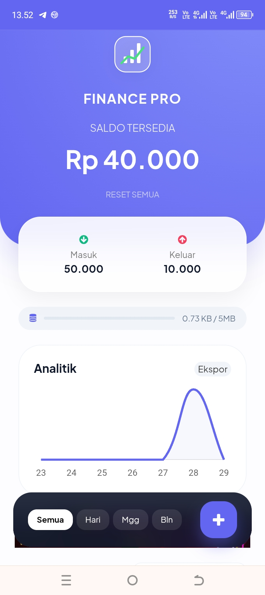
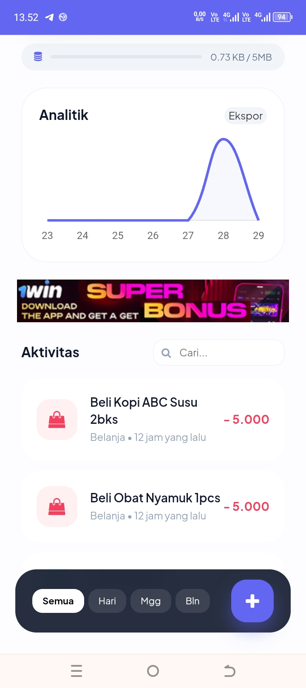
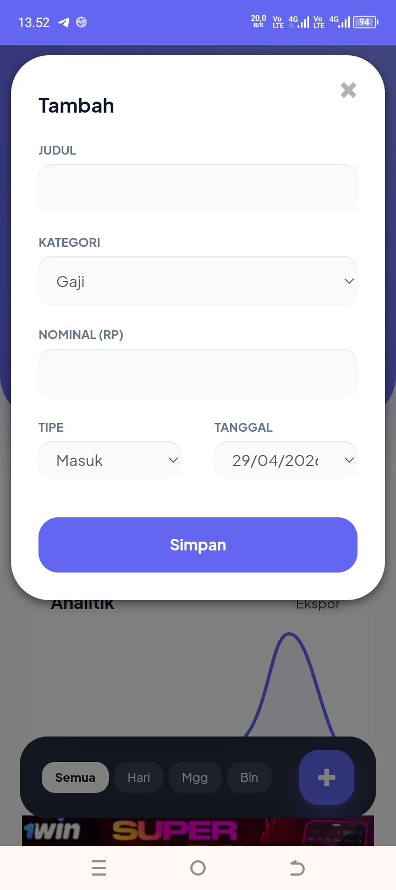

# 💰 Finance Pro - PWA Financial Tracker

**Finance Pro** adalah aplikasi pencatat keuangan berbasis web (Progressive Web App) yang dirancang dengan estetika modern, fokus pada penggunaan mobile, dan performa yang ringan. Aplikasi ini memungkinkan pengguna untuk memantau pemasukan dan pengeluaran secara real-time dengan visualisasi data yang interaktif melalui desain Glassmorphism yang mewah.

* **Demo**: [https://finance-pro-alpha.vercel.app](https://finance-pro-alpha.vercel.app)

---

## 📸 Screenshot

<p align="center">
    
    <br>
    <b>Tampilan Utama Finance Pro</b>
</p>

<p align="center">
    
    <br>
    <b>Tampilan Bawah Finance Pro</b>
</p>

<p align="center">
    
    <br>
    <b>Tampilan Input Data Finance Pro</b>
</p>

## ✨ Fitur Utama

* **📱 Desain Mobile-First**: Antarmuka yang dioptimalkan khusus untuk perangkat seluler dengan nuansa aplikasi native.
* **🎨 Glassmorphism UI**: Tampilan modern menggunakan efek blur transparan, font Plus Jakarta Sans, dan palet warna yang elegan.
* **📊 Visualisasi Chart.js**: Grafik interaktif untuk melihat proporsi pemasukan vs pengeluaran secara instan.
* **🚀 PWA Ready**: Dapat diinstal di Android dan iOS tanpa melalui App Store. Mendukung instalasi melalui banner kustom.
* **🔍 Pencarian & Filter Pintar**:
    * Filter cepat berdasarkan periode (Hari ini, Minggu ini, Bulan ini).
    * Kotak pencarian dengan tombol 'Clear' (X) dinamis.
* **📂 Ekspor Data**: Fitur ekspor ke format CSV (Excel) dan tata letak cetak PDF yang bersih dan profesional.
* **💾 Local Storage Persistence**: Data disimpan secara aman di browser pengguna (Privasi Terjamin).
* **🚫 Anti-Adblock Friendly**: Terintegrasi dengan sistem deteksi iklan untuk pengalaman pengguna yang lebih baik.

## 🛠️ Stack Teknologi

* **Frontend**: HTML5, CSS3 (Custom Glassmorphism), Bootstrap 3.4.1.
* **Logic**: jQuery (DOM Manipulation), JavaScript (ES6+).
* **Visual**: [Chart.js](https://www.chartjs.org/) untuk analisis grafik.
* **Ikon & Font**: Font Awesome & Plus Jakarta Sans.
* **PWA**: Service Workers & Web App Manifest.

## 🚀 Instalasi & Deployment

### Jalankan Secara Lokal
1.  Clone repositori ini:
    ```bash
    gh repo clone aingendi-dev/Finance-Pro
    ```
2.  Buka file `index.html` di browser pilihan Anda.

### Deployment ke Vercel (Rekomendasi)
Untuk fitur PWA yang sempurna (HTTPS & Tanpa Redirect Cookie):
1.  Daftar di [Vercel](https://vercel.com).
2.  Tarik dan lepaskan folder proyek ke dashboard Vercel.
3.  Aplikasi Anda akan online dalam hitungan detik.

## 📂 Struktur File

* `index.html` - Struktur utama aplikasi dan UI.
* `site.webmanifest` - Konfigurasi agar aplikasi dapat diinstal di HP.
* `sw.js` - Service Worker untuk mendukung fungsionalitas PWA.
* `favicon/` - Folder untuk gambar dan ikon.

## 📝 Catatan Penggunaan
Aplikasi ini menggunakan **Local Storage**. Jika Anda menghapus data browser, riwayat transaksi akan ikut terhapus. Gunakan fitur **Ekspor CSV** secara berkala untuk mencadangkan data Anda.

## 💰 Dukung Saya
* [Donasi via Saweria](https://saweria.co/kangendi)

Dukungan Anda akan sangat berharga bagi saya, untuk tetap bisa membangun Project menarik lainnya.

## 📄 Lisensi
Proyek ini dilisensikan di bawah **MIT License**.

---
*Dibuat dengan ❤️ untuk manajemen keuangan yang lebih baik.*
